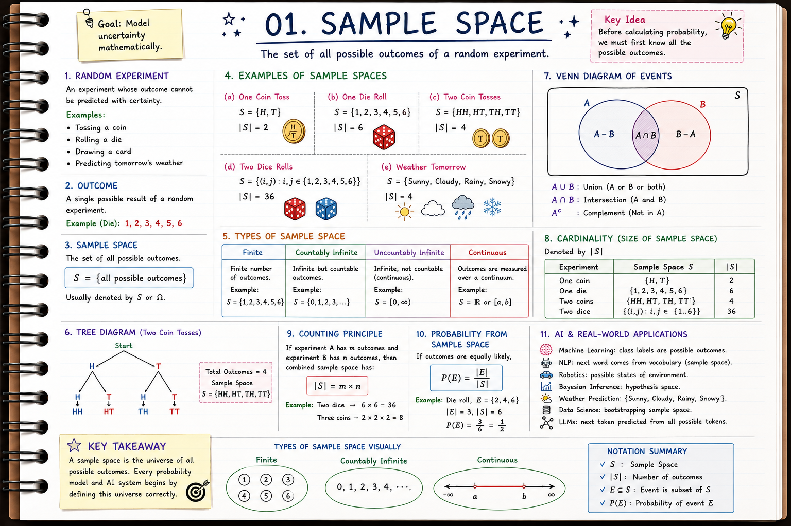

# 🎲 Sample Space

## Overview

**Sample Space** is the starting point of Probability Theory. Every probabilistic experiment begins with a set of all possible outcomes, known as the **sample space**. Understanding sample spaces allows us to model uncertainty mathematically and serves as the foundation for events, conditional probability, random variables, Bayesian inference, and machine learning.

Whether we're tossing a coin, rolling a die, predicting tomorrow's weather, or training an AI model, defining the sample space is the first step toward making probabilistic decisions.

---

# 🎯 Learning Objectives

After completing this chapter, you will be able to:

- Understand random experiments.
- Define outcomes and sample spaces.
- Differentiate finite, countable, and continuous sample spaces.
- Represent sample spaces using sets and diagrams.
- Compute probabilities from sample spaces.
- Solve real-world probability problems.
- Understand how sample spaces are used in AI and Machine Learning.

---

# 📚 Topics Covered

- Random Experiments
- Outcomes
- Sample Space
- Types of Sample Spaces
- Finite Sample Space
- Infinite Sample Space
- Countable Sample Space
- Continuous Sample Space
- Set Representation
- Tree Diagrams
- Venn Diagrams
- Counting Outcomes
- Probability from Sample Space
- Practical Examples

---

# 📂 Files

- **Theory.md** – Conceptual explanation and intuition
- **Mathematics.md** – Mathematical derivations and notation
- **Python-Implementation.ipynb** – Python implementations using NumPy and simulations
- **Visualization.ipynb** – Interactive probability visualizations
- **Applications-in-AI.md** – AI and ML use cases
- **Interview-Questions.md** – Practice questions
- **Research-Papers.md** – Recommended reading
- **References.md** – Books, papers, and online resources

---

# 🤖 Applications in AI

Sample spaces are fundamental to:

- Probabilistic Machine Learning
- Bayesian Inference
- Reinforcement Learning
- Decision Theory
- Computer Vision
- Robotics
- Natural Language Processing
- Large Language Models
- Monte Carlo Simulation

---

# 🛠 Prerequisites

No prior probability knowledge is required. Familiarity with basic set theory and high-school mathematics is sufficient.

---

# 🚀 What's Next?

In the next chapter, **02_Events**, you'll learn how to define subsets of a sample space and compute probabilities for meaningful outcomes, laying the groundwork for conditional probability and Bayesian reasoning.

---

## 🌟 Key Takeaway

A **sample space** is the mathematical universe of all possible outcomes of an experiment. Every probability model, statistical analysis, and AI algorithm begins by defining this universe correctly. Mastering sample spaces is the first step toward understanding how intelligent systems reason under uncertainty.
